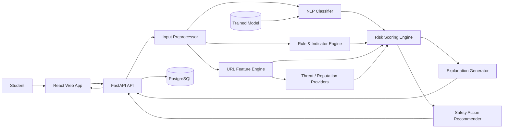

# Student ScamGuard AI — Architecture

## 1. Architecture Principles
1. Explainability over opaque predictions.
2. Defense in depth: ML + rules + URL intelligence.
3. External services are optional enrichments, not single points of failure.
4. Privacy by default.
5. API contracts are stable and versioned.
6. The frontend never owns security decisions; the backend is authoritative.

## 2. High-Level Architecture Diagram

## 3. Logical Components

### Frontend
Responsible for input, validation, result visualization, education content, and accessibility.

### API Layer
Validates requests, orchestrates analysis, enforces rate limits/authentication when enabled, and returns versioned response schemas.

### Input Preprocessor
Normalizes whitespace, Unicode, URLs, and text. Extracts URLs and redacts sensitive values from logs.

### NLP Classifier
Produces scam probability and optional scam category probabilities.

### Rule & Indicator Engine
Detects interpretable indicators such as payment requests, OTP requests, urgency, guaranteed placement claims, suspicious sender phrasing, and unrealistic reward language.

### URL Feature Engine
Extracts lexical and structural URL features and optionally queries approved reputation providers.

### Risk Scoring Engine
Combines model probabilities, rule evidence, URL signals, and reputation results using configuration-driven weights and caps.

### Explanation Generator
Converts structured findings into student-friendly reasons. It must not invent evidence that is absent from the analyzer output.

### Safety Action Recommender
Maps detected risk types to safe actions.

### Persistence
Stores minimal analysis metadata only when needed. Raw input should be omitted or encrypted/retained briefly under explicit policy.

## 4. Data Flow
1. User submits content.
2. API validates and normalizes it.
3. URLs are extracted.
4. Independent analyzers produce structured evidence.
5. Risk engine calculates a normalized score.
6. Classification threshold is applied.
7. Explanation and actions are generated from evidence.
8. Structured response is sent to the UI.

## 5. Deployment
For hackathon deployment:
- Frontend: Vercel/Netlify or a Docker container.
- Backend: Render/Railway/Fly.io/AWS/Azure/GCP equivalent.
- Database: managed PostgreSQL or local SQLite for demo.
- Secrets: deployment platform secret manager/environment variables.
