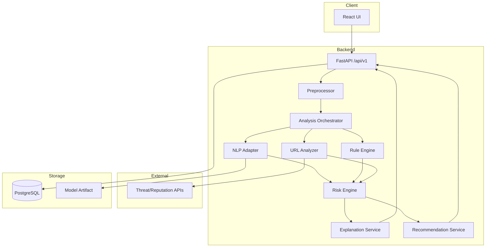

# High-Level Design (HLD)

## 1. System Modules

| Module | Responsibility | Key Output |
|---|---|---|
| Web UI | Collect input and render findings | User interaction |
| API Gateway | Request validation/orchestration | Versioned API response |
| Preprocessor | Normalize text and extract URLs | Clean text + URLs |
| NLP Service | Scam classification | Probabilities + category |
| Rule Engine | Detect explainable indicators | Evidence list |
| URL Analyzer | URL feature analysis | URL evidence |
| Reputation Adapter | External URL intelligence | Reputation signals |
| Risk Engine | Combine all signals | 0–100 score + label |
| Explanation Service | Explain findings | Reasons |
| Recommendation Service | Safety actions | Action list |
| Persistence | Optional analytics/history | Analysis metadata |

## 2. HLD Component Diagram

## 3. API Boundaries

### POST `/api/v1/analyze/text`
Analyzes text only.

### POST `/api/v1/analyze/url`
Analyzes a URL only.

### POST `/api/v1/analyze`
Combined analysis of text + URLs.

### GET `/api/v1/health`
Health/readiness endpoint.

### GET `/api/v1/education/scam-types`
Returns awareness content.

## 4. Error Handling
- 400: invalid input
- 422: schema validation failure
- 429: rate limit
- 503: optional external dependency unavailable; return partial analysis where safe
- 500: unexpected server error, without exposing internals

## 5. Security Controls
- HTTPS in deployment
- Input length limits
- URL scheme allowlist (`http`, `https`)
- Server-side request protection against SSRF when fetching URLs
- Rate limiting
- CORS allowlist
- Environment-based secret management
- No secret values in logs

## 6. Observability
Track:
- request latency
- success/error counts
- model version
- ruleset version
- external-service availability
- aggregate classification counts

Do not log raw messages or sensitive content by default.
